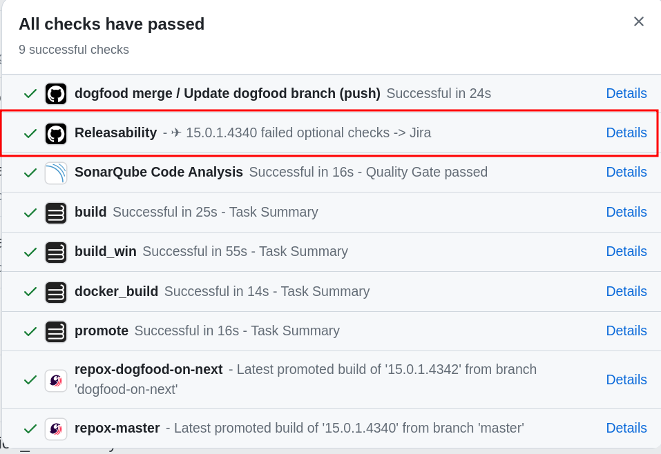

# SonarSource GitHub Action for releasability checks


[](https://sonarcloud.io/summary/new_code?id=SonarSource_gh-action_releasability)
[](https://github.com/SonarSource/gh-action_releasability/actions/workflows/it-test.yml)

Trigger [ops-releasability checks](https://github.com/SonarSource/ops-releasability) and collect results.

## List of Checks

Please refer to
the [End-User documentation](https://xtranet-sonarsource.atlassian.net/wiki/spaces/Platform/pages/3309240895/End-user+Documentation+-+Releasability)
for a list of checks and their description.

- CheckDependencies
- QA
- Jira
- CheckPeacheeLanguagesStatistics
- QualityGate
- ParentPOM
- GitHub
- CheckManifestValues

### Version 3 and Later

The WhiteSource (Mend) check was removed as of version 3.0.0, in favor of Sonar Quality Gate with Dependency Risks enabled. This is
available to all projects using CI GitHub Actions (<https://github.com/SonarSource/ci-github-actions/>), projects using Next, and projects
using Unified Dogfooding.

## Usage

> [!WARNING]
> Releasability status checks will not work if you have Merge queue enabled on the repository

### Verify that all releasability checks pass before actually doing a new release

Trigger manually:
[releasability_checks.yml](https://github.com/SonarSource/gh-action_releasability/actions/workflows/releasability_checks.yml)


List of [parameters](#options)

### Show current releasability status in default branch

To show releasability status of the latest promoted version from the default branch,

#### Usage with GitHub Actions pipelines

##### Option 1: Create a separate workflow file (recommended)

Create a dedicated `releasability.yml` workflow that triggers after your build workflow completes:

###### .github/workflows/build.yml

The workflow must include `name: Build` because the releasability workflow references this workflow's name in the trigger.

###### .github/workflows/releasability.yml

> [!IMPORTANT]
> This event will only trigger a workflow run if the workflow file exists on the default branch.

```yaml
name: Releasability Status
on:
    workflow_run:
        workflows: [ "Build" ]  # Name must match the name of the build workflow
        types: [ completed ]
        branches:
            - master
            - dogfood-*
            - branch-*

jobs:
    releasability-status:
        name: Releasability status
        runs-on: sonar-xs # Use any runner
        permissions:
            id-token: write
            statuses: write
            contents: read
        if: github.event.workflow_run.conclusion == 'success'
        steps:
            -   uses: SonarSource/gh-action_releasability/releasability-status@v3
                with:
                    optional_checks: "Jira"
                env:
                    GITHUB_TOKEN: ${{ github.token }}
```

This approach provides complete separation of concerns - your build workflow focuses on
building and testing, while the releasability workflow handles release readiness checks.

##### Option 2: Create a separate job with dependency

```yaml
name: Build
on:
    push:
        branches:
            - master
            - dogfood-*
            - branch-*

jobs:
    build:
    # build job configuration

    promote:
        needs: build
        # promote job configuration

    releasability-status:
        name: Releasability status
        runs-on: sonar-xs # Use any runner
        permissions:
            id-token: write
            statuses: write
            contents: read
        needs: promote  # Wait for promote to complete successfully
        if: >-
            github.ref_name == github.event.repository.default_branch ||
            startsWith(github.ref_name, 'dogfood-') ||
            startsWith(github.ref_name, 'branch-')
        steps:
            -   uses: SonarSource/gh-action_releasability/releasability-status@v3
                with:
                    optional_checks: "Jira"
                env:
                    GITHUB_TOKEN: ${{ github.token }}
```

##### Option 3: Add as a step in your existing build job

```yaml
name: Build
on:
    push:
        branches:
            - master
            - dogfood-*
            - branch-*
    pull_request:

jobs:
    build:
        name: Build
        runs-on: sonar-xs # Use any runner
        permissions:
            id-token: write
            contents: read
            statuses: write
        steps:
            # Build and promote job steps
                ...
                # Add releasability status check after build steps
                - uses: SonarSource/gh-action_releasability/releasability-status@v3
                if: >-
                    github.ref_name == github.event.repository.default_branch ||
                    startsWith(github.ref_name, 'dogfood-') ||
                    startsWith(github.ref_name, 'branch-')
                with:
                    optional_checks: "Jira"
                env:
                    GITHUB_TOKEN: ${{ github.token }}
```

#### Legacy: Usage with Cirrus CI pipelines

> **Note**: This example is for projects still using Cirrus CI. For GitHub Actions pipelines, use the examples above.

```yaml
name: Releasability status
'on':
    check_suite:
        types: [ completed ]
jobs:
    update_releasability_status:
        runs-on: sonar-xs # Use any runner
        name: Releasability status
        permissions:
            id-token: write
            statuses: write
            contents: read
        if: >-
            (contains(fromJSON('["main", "master"]'),
            github.event.check_suite.head_branch) ||
            startsWith(github.event.check_suite.head_branch, 'dogfood-') ||
            startsWith(github.event.check_suite.head_branch, 'branch-')) &&
            github.event.check_suite.conclusion == 'success' &&
            github.event.check_suite.app.slug == 'cirrus-ci'
        steps:
            -   uses: >-
                    SonarSource/gh-action_releasability/releasability-status@v3
                with:
                    optional_checks: "Jira"
                env:
                    GITHUB_TOKEN: '${{ secrets.GITHUB_TOKEN }}'
```

This will run the releasability checks once your build pipeline completes and update the commit status as below.


The parameter `optional_checks` is optional. You can provide a comma-separated list of checks to be treated as
optional while doing releasability checks. Failure in any of these checks will not mark the commit status as red,
but provide the details in commit status description.

This will be helpful in case you have a few checks which are expected to fail until the day of the Release.
Eg: Jira check will fail until the release, since there will be work-in-progress tickets throughout the sprint.
If you add this parameter, make sure to check the description for failed optional checks before triggering an actual release.



### Check Releasability Status From Another Repository

Within an existing GitHub workflow:

```yaml

...
steps:
    -   uses: SonarSource/gh-action_releasability@v3
        id: releasability-checks
        with:
            organization:
            repository:
            branch:
            version:
            commit-sha:
```

The following permission is required:

```yaml
permissions:
    id-token: write
```

### Options

| Option name       | Description                                                                     | Default |
|-------------------|---------------------------------------------------------------------------------|---------|
| `organization`    | The GitHub organization used (i.e: SonarSource)                                 | -       |
| `repository`      | The GitHub repository name                                                      | -       |
| `branch`          | The GitHub repository branch name                                               | -       |
| `version`         | The version to check (`[prefix-]major.minor.patch.build_number`)                | -       |
| `commit-sha`      | The GitHub commit SHA                                                           | -       |
| `ignore-failure`  | Whether to fail or not the GitHub action in case of Releasability check failure | `false` |
| `releasabily-env` | For development purposes, the environment to use (`prod`, `staging`, or `dev`)  | `prod`  |

## Development

### Versioning

This project is using [Semantic Versioning](https://semver.org/).

The `master` branch shall not be referenced by end-users.

If you use [Renovate](https://docs.renovatebot.com/) or [Dependabot](https://docs.github.com/en/code-security/dependabot),
use the latest released tag.

Alternatively, use the `v*` branches which will kept up-to-date with latest released tag

### Releasing

Create a new release on [GitHub](https://github.com/SonarSource/gh-action_releasability/releases)
following semantic versioning.

To update the v-branch,
run the [Update v-branch workflow](https://github.com/SonarSource/gh-action_releasability/actions/workflows/update-v-branch.yml).
The workflow will update the v-branch to the specified tag.

### Contribute

Contributions are welcome, please have a look at [DEV.md](./DEV.md)

### Testing

Use the `releasabily-env` option to test the action with a different AWS account (staging or development).
