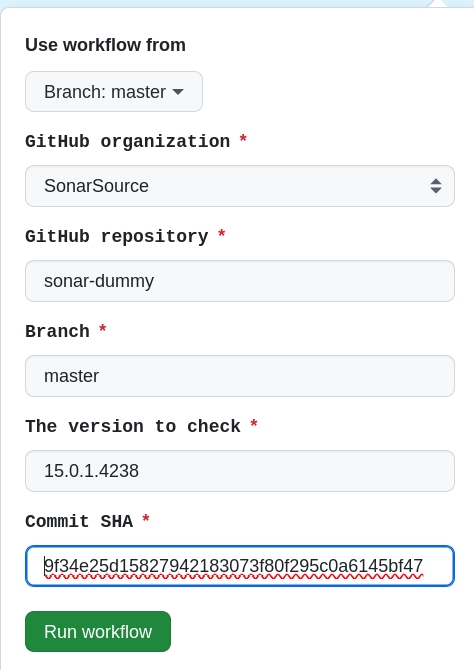
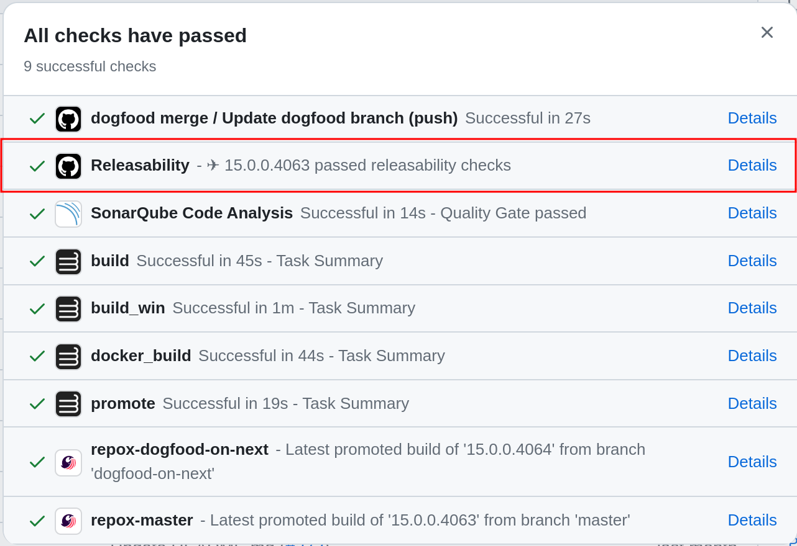

# SonarSource GitHub Action for releasability checks


[](https://sonarcloud.io/summary/new_code?id=SonarSource_gh-action_releasability)
[](https://github.com/SonarSource/gh-action_releasability/actions/workflows/it-test.yml)

Trigger [ops-releasability checks](https://github.com/SonarSource/ops-releasability) and collect results.

## Usage

### Verify that all releasability checks pass before actually doing a new release

Trigger manually:
[releasability_checks.yml](https://github.com/SonarSource/gh-action_releasability/actions/workflows/releasability_checks.yml)



### Show current releasability status in default branch

To show releasability status of the latest promoted version from the default branch,

```yaml
name: Releasability status
'on':
  check_suite:
    types:
      - completed
jobs:
  update_releasability_status:
    runs-on: ubuntu-latest
    name: Releasability status
    permissions:
      id-token: write
      statuses: write
      contents: read
    if: >-
      (contains(fromJSON('["main", "master"]'),
      github.event.check_suite.head_branch) ||
      startsWith(github.event.check_suite.head_branch, 'dogfood-') ||
      startsWith(github.event.check_suite.head_branch, 'branch-')) &&
      github.event.check_suite.conclusion == 'success' &&
      github.event.check_suite.app.slug == 'cirrus-ci'
    steps:
      - uses: >-
          SonarSource/gh-action_releasability/releasability-status@v1
        env:
          GITHUB_TOKEN: '${{ secrets.GITHUB_TOKEN }}'
```

This will run the releasability checks once the cirrus tasks are completed and update the commit status as below.



> [!WARNING]
> Releasability status checks will not work if you have Merge queue enabled on the repository

### Use as a step in another workflow

Within an existing GitHub workflow:

```yaml

...
    steps:
      - uses: SonarSource/gh-action_releasability@v1
        id: releasability-checks
        with:
          organization:
          repository:
          branch:
          version:
          commit-sha:
```

The following permission is required:

```yaml
permissions:
  id-token: write
```

## Options

| Option name      | Description                                                                                             | Default |
|------------------|---------------------------------------------------------------------------------------------------------|---------|
| `organization`   | Used to specify the GitHub organization used (i.e: SonarSource)                                         | -       |
| `repository`     | Used to specify the GitHub repository name                                                              | -       |
| `branch`         | Used to specify the GitHub repository branch name                                                       | -       |
| `version`        | Used to specify the version to check (Using Sonar org format: `x.x.x.x` `major.minor.patch.build_number`) | -       |
| `commit-sha`     | Used to specify the GitHub commit sha to use                                                            | -       |
| `ignore-failure` | Used to not fail the gh-action in case of releasability check failure                                   | `false` |

## Versioning

This project is using [Semantic Versioning](https://semver.org/).

The `master` branch shall not be referenced by end-users.

If you use [Renovate](https://docs.renovatebot.com/) or [Dependabot](https://docs.github.com/en/code-security/dependabot),
use the latest released tag.

Alternatively, use the `v*` branches which will kept up-to-date with latest released tag

## Releasing

Create a new release on [Github](https://github.com/SonarSource/gh-action_releasability/releases)
following semantic versioning.

To update the v-branch,
run the [Update v-branch workflow](https://github.com/SonarSource/gh-action_releasability/actions/workflows/update-v-branch.yml).
The workflow will update the v-branch to the specified tag.

## Contribute

Contributions are welcome, please have a look at [DEV.md](./DEV.md)
