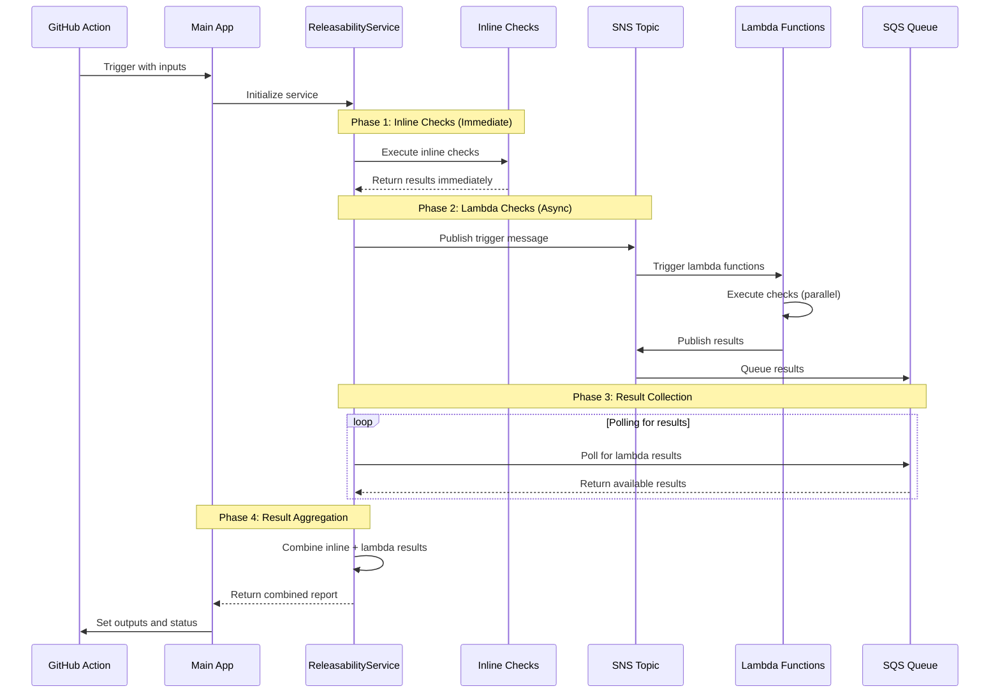

# Releasability Checks Architecture Diagram

## Hybrid Architecture Overview

This diagram shows the proposed hybrid architecture that supports both inline checks and existing lambda-based checks.

```mermaid
graph TB
    subgraph "GitHub Actions Environment"
        GA[GitHub Action<br/>action.yml]
        MA[Main Application<br/>src/main.py]
    end

    subgraph "Python Application"
        RS[ReleasabilityService<br/>Enhanced with inline checks]
        CR[Check Registry<br/>Manages both check types]

        subgraph "Inline Check Framework"
            IC1[CheckManifestValues<br/>Inline Check]
            IC2[NewCustomCheck<br/>Inline Check]
            IC3[CheckDependencies<br/>Inline Check]
        end

        subgraph "Result Processing"
            RCR[ReleasabilityCheckResult<br/>Unified result format]
            RCRP[ReleasabilityChecksReport<br/>Combined results]
        end
    end

    subgraph "AWS Infrastructure"
        SNS1[SNS Topic<br/>ReleasabilityTriggerTopic]
        SQS[SQS Queue<br/>ReleasabilityResultQueue]
        SNS2[SNS Topic<br/>ReleasabilityResultTopic]

        subgraph "Lambda Functions"
            L1[QA Lambda]
            L2[Jira Lambda]
            L3[QualityGate Lambda]
            L4[ParentPOM Lambda]
            L5[GitHub Lambda]
            L6[CheckPeacheeLanguagesStatistics Lambda]
        end
    end

    subgraph "External Services"
        EXT1[QA System]
        EXT2[Jira API]
        EXT3[SonarQube]
        EXT4[GitHub API]
        EXT5[Artifactory]
    end

    %% Main flow
    GA -->|"Trigger with inputs"| MA
    MA -->|"Initialize service"| RS

    %% Inline check execution (immediate)
    RS -->|"Execute immediately"| IC1
    RS -->|"Execute immediately"| IC2
    RS -->|"Execute immediately"| IC3

    %% Inline check results
    IC1 -->|"ReleasabilityCheckResult"| RCR
    IC2 -->|"ReleasabilityCheckResult"| RCR
    IC3 -->|"ReleasabilityCheckResult"| RCR

    %% Lambda check execution (async)
    RS -->|"Publish SNS message"| SNS1
    SNS1 -->|"Trigger"| L1
    SNS1 -->|"Trigger"| L2
    SNS1 -->|"Trigger"| L3
    SNS1 -->|"Trigger"| L4
    SNS1 -->|"Trigger"| L5
    SNS1 -->|"Trigger"| L6

    %% Lambda external calls
    L1 -->|"API calls"| EXT1
    L2 -->|"API calls"| EXT2
    L3 -->|"API calls"| EXT3
    L4 -->|"API calls"| EXT4
    L5 -->|"API calls"| EXT6
    L6 -->|"API calls"| EXT5

    %% Lambda results
    L1 -->|"Publish results"| SNS2
    L2 -->|"Publish results"| SNS2
    L3 -->|"Publish results"| SNS2
    L4 -->|"Publish results"| SNS2
    L5 -->|"Publish results"| SNS2
    L6 -->|"Publish results"| SNS2

    SNS2 -->|"Queue messages"| SQS
    SQS -->|"Poll for results"| RS

    %% Result aggregation
    RCR -->|"Combine with lambda results"| RCRP
    RS -->|"Lambda results"| RCRP

    %% Final output
    RCRP -->|"Process results"| MA
    MA -->|"Set GitHub outputs"| GA

    %% Styling
    classDef inlineCheck fill:#e1f5fe,stroke:#01579b,stroke-width:2px
    classDef lambdaCheck fill:#fff3e0,stroke:#e65100,stroke-width:2px
    classDef awsService fill:#f3e5f5,stroke:#4a148c,stroke-width:2px
    classDef externalService fill:#e8f5e8,stroke:#1b5e20,stroke-width:2px
    classDef resultProcessing fill:#fff8e1,stroke:#f57f17,stroke-width:2px

    class IC1,IC2,IC3 inlineCheck
    class L1,L2,L3,L4,L5,L6,L7 lambdaCheck
    class SNS1,SQS,SNS2 awsService
    class EXT1,EXT2,EXT3,EXT4,EXT5,EXT6 externalService
    class RCR,RCRP resultProcessing
```

## Execution Timeline

## Key Benefits

1. **Immediate Execution**: Inline checks run immediately without AWS round-trips
2. **Backward Compatibility**: Existing lambda checks continue to work unchanged
3. **Unified Results**: Both check types use the same result format
4. **Cost Efficiency**: Inline checks reduce AWS lambda costs
5. **Development Speed**: Faster iteration and testing of new checks
6. **Reliability**: Reduced dependency on AWS infrastructure for new checks

## Migration Path

1. **Phase 1**: Implement inline framework alongside existing system
2. **Phase 2**: Migrate simple checks to inline (e.g., CheckManifestValues)
3. **Phase 3**: Add new checks as inline by default
4. **Phase 4**: Gradually migrate remaining checks based on complexity
